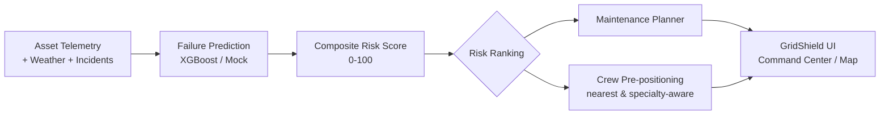
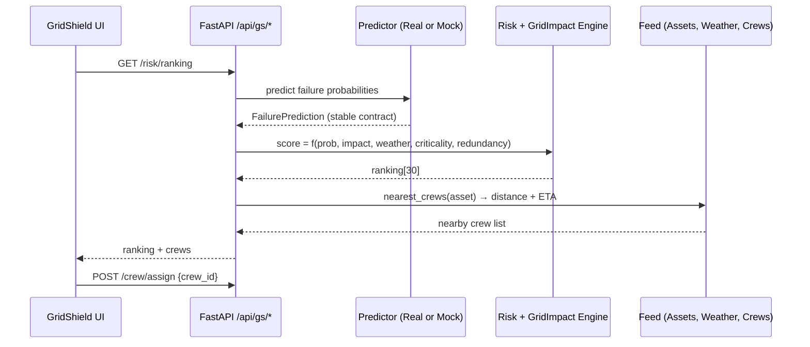
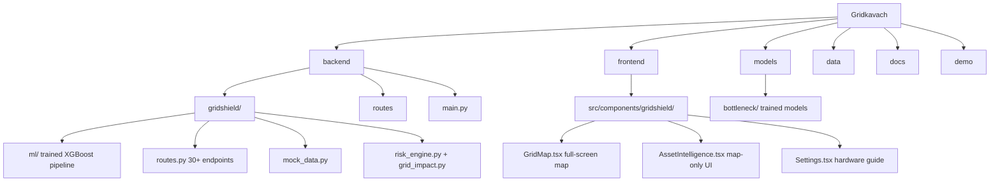
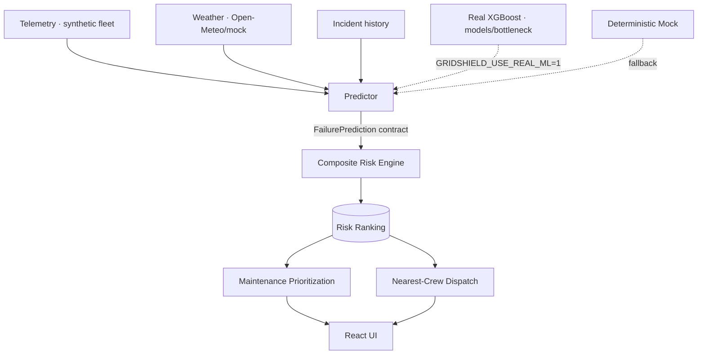
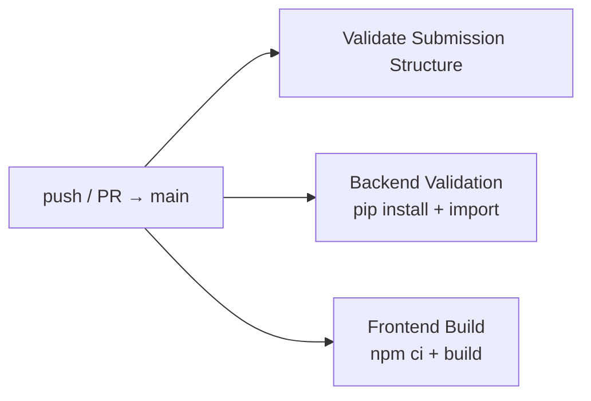

# GridShield AI — Power Outage Prediction & Grid Equipment Failure Advisor

> IBM Bob Hackathon 2026 · Track U1 · Team `bottleneck`

GridShield is an AI-powered grid reliability platform that combines asset telemetry, weather forecasts, and incident history to **predict** equipment failures, **explain** why they happen, **prioritize** them by operational impact, and **position** field crews before outages occur.

**Core story:** `PREDICT → EXPLAIN → PRIORITIZE → POSITION`



---

## Team

| Field | Value |
|-------|-------|
| Team Name | `bottleneck` |
| Track | U1 — Power Outage Prediction & Grid Equipment Failure Advisor |
| Team Lead | Heet Mehta — heetmehta18125@gmail.com |
| Team Members | Heet Mehta · Dhruvin Vaghasiya · Urval Kheni |
| Repository | https://github.com/HEETMEHTA18/bob-ai-hackathon-bottleneck |

---

## Problem Statement

Power utilities lose billions annually to preventable equipment failures. Reactive maintenance wastes resources on low-risk assets while critical ones degrade undetected. Existing tools focus on failure probability alone, ignoring the downstream grid impact — how many customers lose power, which critical facilities go dark, and what the cascading effects are. Without impact-aware prioritization, crews are dispatched reactively rather than pre-positioned proactively.

---

## Solution

GridShield fuses asset telemetry, weather exposure, and incident history into a **composite risk score** (0–100) that factors in failure probability, grid impact, weather severity, asset criticality, and redundancy. It then turns risk into action:

- **Real ML pipeline** — trained XGBoost models for 24h / 72h failure probability and anomaly scoring (with a deterministic mock fallback so the app always boots)
- **Impact-aware prioritization** — maintenance ranked by how many customers and critical facilities are affected, not just probability
- **Nearest-crew dispatch** — crews ranked by specialty match + haversine distance with ETA, assignable directly from the map
- **Grounded AI copilot** — every recommendation is backed by backend data; the assistant never invents sensor values
- **Hardware integration** — register maps and protocol docs (Modbus, DNP3, IEC 61850, MQTT, OPC-UA) with test/sync endpoints



---

## Key Features

- **Impact-aware risk scoring** — failure probability × grid impact × weather × criticality × redundancy (0–100)
- **30-asset synthetic fleet** — realistic degradation profiles with telemetry, incidents, and maintenance history
- **Real ML with graceful fallback** — XGBoost models in `models/bottleneck/`; deterministic mock if models are missing
- **Full-screen asset map** — risk-colored markers, safety zones, crew depots, dispatch lines, scenario + layer controls
- **Nearest-crew dispatch** — specialty-match then distance ranking with ETA, assign from map popup or intelligence panel
- **Hardware integration** — protocol docs, register maps, and `test`/`sync` endpoints for field devices
- **Scenario simulator** — Severe Storm, Heatwave, Asset Degradation what-if analysis
- **Grounded AI copilot** — all answers backed by backend data; never invents sensor values or statistics
- **30+ REST endpoints** under `/api/gs/` — full CRUD, auth-protected (JWT)

---

## Tech Stack

| Category | Technologies |
|----------|-------------|
| Languages | Python 3.11, TypeScript |
| Frameworks | FastAPI, React 18, Vite |
| AI/ML | XGBoost (trained failures/anomaly models), deterministic mock fallback |
| IBM Technologies | IBM Bob (primary AI coding agent) |
| AI Copilot | Google Gemini (optional — deterministic fallback without a key) |
| Databases | SQLite (dev) / PostgreSQL (prod, `DATABASE_URL`) |
| Auth | JWT (access + refresh), demo user auto-seeded |
| Infrastructure | Docker, GitHub Actions CI |
| Weather | Open-Meteo API / deterministic cache |

---

## Repo Structure



```
├── backend/                 # FastAPI backend
│   ├── gridshield/          # GridShield domain
│   │   ├── ml/              # Real XGBoost pipeline (feature eng, train, predict, evaluate)
│   │   ├── contracts.py     # Pydantic schemas (stable FailurePrediction contract)
│   │   ├── risk_engine.py   # Composite scoring + nearest-crew ranking
│   │   ├── grid_impact.py   # Downstream impact model
│   │   ├── mock_data.py     # 30-asset synthetic fleet + crew bases + hardware configs
│   │   ├── routes.py        # /api/gs/* endpoints
│   │   └── service.py       # Service layer orchestrating predictors
│   ├── routes/              # Auth, chat, data, forecast, insights, sites
│   └── main.py              # App entry (serves frontend/dist in prod)
├── frontend/                # React/TypeScript SPA
│   └── src/components/gridshield/
│       ├── GridMap.tsx          # Full-screen map + embedded map
│       ├── AssetIntelligence.tsx# Map-only asset intelligence w/ overlay panel
│       ├── CommandCenter.tsx    # Dashboard, KPIs, ranking table, alerts
│       ├── CrewPlanner.tsx      # Pre-positioning planning
│       ├── ScenarioSimulator.tsx# What-if scenarios
│       ├── Settings.tsx         # Hardware integration guide + test/sync
│       └── Copilot.tsx          # Grounded AI advisor
├── models/bottleneck/       # Trained XGBoost failure/anomaly artifacts
├── data/                    # Generated training telemetry + weather cache
├── docs/                    # Docs (index below)
├── demo/                    # Video link, live URL, screenshots
├── .github/workflows/       # CI validation
├── Dockerfile · docker-compose.yml
└── requirements.txt
```

---

## Get Started

### Prerequisites

| Tool | Version |
|------|---------|
| Python | 3.10+ |
| Node.js | 18+ (`npm` 9+) |
| Git | any |

> Demo login is seeded automatically on first boot:
> **`demo@gridshield.ai` / `demo1234`**

### Option A — Docker (easiest)

```bash
docker-compose up --build
# App:  http://localhost:8000
# Health: http://localhost:8000/health
```

### Option B — Backend only (serves the pre-built frontend)

```bash
git clone https://github.com/HEETMEHTA18/bob-ai-hackathon-bottleneck.git
cd Gridkavach

python -m venv .venv && source .venv/bin/activate
pip install -r requirements.txt

# Build the frontend once (outputs frontend/dist, which FastAPI serves)
cd frontend && npm install && npm run build && cd ..

# Start the backend — it serves the UI at :8000
uvicorn backend.main:app --host 0.0.0.0 --port 8000
# App:  http://localhost:8000
```

### Option C — Dev mode (hot reload)

```bash
# Terminal 1 — backend (:8000)
source .venv/bin/activate
uvicorn backend.main:app --reload --host 0.0.0.0 --port 8000

# Terminal 2 — frontend Vite dev server (:5173, proxies /api & /auth to :8000)
cd frontend
npm install
npm run dev
# App:  http://localhost:5173
```

### Verify it's running

```bash
curl -s http://localhost:8000/health
curl -s -X POST http://localhost:8000/auth/login \
  -H 'Content-Type: application/json' \
  -d '{"email":"demo@gridshield.ai","password":"demo1234"}'
# → { "access_token": "…", "refresh_token": "…" }
```

No external API keys are required. Set `GEMINI_API_KEY` to enable the AI copilot's LLM answers (deterministic fallback otherwise). Set `GRIDSHIELD_USE_REAL_ML=1` (default) to use the trained XGBoost pipeline; missing models fall back to the mock predictor.

---

## Application Pages

| Page | Description |
|------|-------------|
| **Command Center** | Live KPIs, 30-asset risk ranking table, active alerts |
| **Grid Map** | Full-screen map with risk markers, crew depots, scenario + layer controls, hover cards |
| **Asset Intelligence** | Map-only view — asset risk zone, nearest crew depots, dispatch lines + overlay intelligence panel |
| **Maintenance Planner** | Impact-aware priorities with filtering |
| **Crew Planner** | Pre-positioning + dispatch assignments |
| **Scenario Simulator** | What-if: Severe Storm, Heatwave, Asset Degradation |
| **AI Advisor** | Grounded Grid Operations Intelligence |
| **Settings** | Hardware integration guides, protocol docs, register maps, test/sync |

---

## API Endpoints

All GridShield endpoints live under `/api/gs/` and require a Bearer token from `POST /auth/login`:

```text
# Assets & intelligence
GET   /api/gs/assets                                  # List all 30 grid assets
GET   /api/gs/assets/{id}                             # Asset detail
GET   /api/gs/assets/{id}/telemetry                   # 48h hourly telemetry
GET   /api/gs/assets/{id}/incidents                   # Incident history
GET   /api/gs/assets/{id}/maintenance                 # Maintenance history
GET   /api/gs/assets/{id}/intelligence                # Full intelligence payload

# Risk & predictions
GET   /api/gs/risk                                    # Single-asset risk
GET   /api/gs/risk/ranking                            # Risk-ranked assets (scenario-aware)
GET   /api/gs/predictions                             # ML failure predictions
GET   /api/gs/ml/status                               # Real-ML vs mock status

# Weather & dashboard
GET   /api/gs/weather                                 # Weather exposure
GET   /api/gs/dashboard/kpis                          # Dashboard KPIs
GET   /api/gs/dashboard/alerts                        # Active alerts

# Maintenance & crews
GET   /api/gs/maintenance/priorities                  # Impact-aware priorities
GET   /api/gs/crew                                    # All crews
GET   /api/gs/crew/plan                               # Pre-positioning plan
GET   /api/gs/assets/{id}/crew/nearby                 # Nearest crews by distance + ETA
POST  /api/gs/assets/{id}/crew/assign                 # Assign nearest (or specific) crew

# Hardware integration
GET   /api/gs/hardware/configs                        # All device configs
GET/PUT /api/gs/assets/{id}/hardware                  # Get / update a device config
POST  /api/gs/assets/{id}/hardware/test               # Connection test
GET   /api/gs/assets/{id}/hardware/readings           # Current register readings
POST  /api/gs/assets/{id}/hardware/sync               # Pull live reading

# Scenarios & AI copilot
POST  /api/gs/scenarios/simulate                      # What-if scenario
POST  /api/gs/chat                                    # AI copilot query
GET   /api/gs/chat/sessions/{id}                      # Copilot session history

# System
GET   /health                                         # Health check
```

---

## Architecture



### ML Integration Seam

`predict_service.py` loads the trained XGBoost models from `models/bottleneck/` on first use (thread-safe cache) and falls back to the deterministic mock if the models are missing — so the app always boots.

```python
# backend/gridshield/ml_adapter.py
GRIDSHIELD_USE_REAL_ML = os.getenv("GRIDSHIELD_USE_REAL_ML", "1")
# "1"  → RealFailurePredictor ← predict_service.py (XGBoost)
# "0"  → MockFailurePredictor (deterministic fallback)
```

The `FailurePrediction` contract is stable — no frontend, risk engine, maintenance planner, or crew planner changes are needed to swap predictors.

### Retraining the models

```bash
# 1. Generate training telemetry + weather cache
python -m backend.gridshield.ml.generate_training_data

# 2. Train 24h/72h failure + anomaly XGBoost models → models/bottleneck/
python -m backend.gridshield.ml.train_models

# 3. Evaluate against holdout
python -m backend.gridshield.ml.evaluate
```

---

## Documentation Index

All docs live in [`docs/`](docs/). The submission-required set is enforced by CI.

| Document | Purpose |
|----------|---------|
| [docs/problem-statement.md](docs/problem-statement.md) | The problem, users, and pain points |
| [docs/solution-overview.md](docs/solution-overview.md) | Solution narrative + differentiators |
| [docs/architecture.md](docs/architecture.md) | System architecture, data flow, ML seam |
| [docs/setup-guide.md](docs/setup-guide.md) | Detailed setup, troubleshooting, deployment |
| [docs/PRD.md](docs/PRD.md) | Product requirements |
| [docs/TRD.md](docs/TRD.md) | Technical requirements & design |
| [docs/GRIDSHIELD_WORK.md](docs/GRIDSHIELD_WORK.md) | Feature work log — what was built and why |
| [docs/GRIDSHIELD_REALML_CHATBOT_RESULTS.md](docs/GRIDSHIELD_REALML_CHATBOT_RESULTS.md) | Real-ML + chatbot validation results |
| [docs/BOB_ENGINEERING_LOG.md](docs/BOB_ENGINEERING_LOG.md) | IBM Bob engineering session log |
| [docs/INTEGRATION.md](docs/INTEGRATION.md) | Frontend↔backend↔ML integration guide |
| [docs/BOB_WORKFLOW.md](docs/BOB_WORKFLOW.md) | IBM Bob agent workflow/playbook |
| [docs/AGENTS.md](docs/AGENTS.md) | Project conventions for AI agents |
| [docs/CONTEXT.md](docs/CONTEXT.md) | Context & definitions |
| [docs/DATA.md](docs/DATA.md) | Data sources & schemas |
| [docs/MODEL.md](docs/MODEL.md) | Model design |
| [docs/ROADMAP.md](docs/ROADMAP.md) | Roadmap |
| [docs/SUBMISSION_ALIGNMENT.md](docs/SUBMISSION_ALIGNMENT.md) | How the repo maps to the brief |
| [docs/TEAM_SPLIT.md](docs/TEAM_SPLIT.md) · `TEAM_1_ML_DATA.md` · `TEAM_2_BACKEND_APIS.md` · `TEAM_3_FRONTEND_UX.md` · `TEAM_4_AI_COPILOT_INTEGRATION.md` | Team ownership |

---

## CI Pipeline

`.github/workflows/validate.yml` runs on every push/PR to `main`:



| Job | Checks |
|-----|--------|
| Validate Submission Structure | Required files exist, `submission.yaml` fields, `.env` not committed |
| Backend Validation | `pip install -r requirements.txt` + `from backend.main import app` |
| Frontend Build | `npm ci` + `npm run build` in `frontend/` |

---

## Environment Variables

| Variable | Required | Description |
|----------|----------|-------------|
| `SECRET_KEY` | No (dev fallback) | JWT signing key — **always set one in production** |
| `GEMINI_API_KEY` | No | Enables AI copilot LLM responses (deterministic fallback otherwise) |
| `GRIDSHIELD_USE_REAL_ML` | No | `1` (default) real XGBoost; `0` = mock predictor |
| `DATABASE_URL` | No | PostgreSQL URL (SQLite used by default) |
| `CORS_ORIGINS` | No | Comma-separated allowed origins (defaults: :5173, :8000) |

---

## Demo

| Artifact | Location |
|----------|----------|
| Demo video | [`demo/demo-video-link.txt`](demo/demo-video-link.txt) |
| Live demo URL | [`demo/live-demo-url.txt`](demo/live-demo-url.txt) |
| Screenshots | See `demo/screenshots/` |
| Presentation | See `presentation/` |

---

## Known Limitations

- Auth is functional but basic — production would use OAuth2/OIDC
- The 30-asset fleet, crew locations, and telemetry are synthetic — production would read from SCADA/IoT + GIS
- Weather uses live Open-Meteo with a deterministic cache fallback
- The trainer uses generated data — retargeting to real SCADA feeds is straightforward via the feature-engineering layer

---

## What We're Most Proud Of

The **ML Integration Seam** — a stable `FailurePrediction` contract lets you swap the trained XGBoost pipeline for any future model (or the mock) without touching the frontend, risk engine, maintenance planner, or crew planner. And the **single-map Asset Intelligence UI**: the asset, its risk zone, and its nearest crews with live dispatch lines all live in one map, with assignment done in two clicks.

---

## IBM Bob Usage

IBM Bob was used as the primary AI coding agent throughout GridShield development. Sessions are logged in [`docs/BOB_ENGINEERING_LOG.md`](docs/BOB_ENGINEERING_LOG.md) and worked examples in [`docs/GRIDSHIELD_WORK.md`](docs/GRIDSHIELD_WORK.md).

---

## License

Internal — IBM Bob Hackathon 2026.