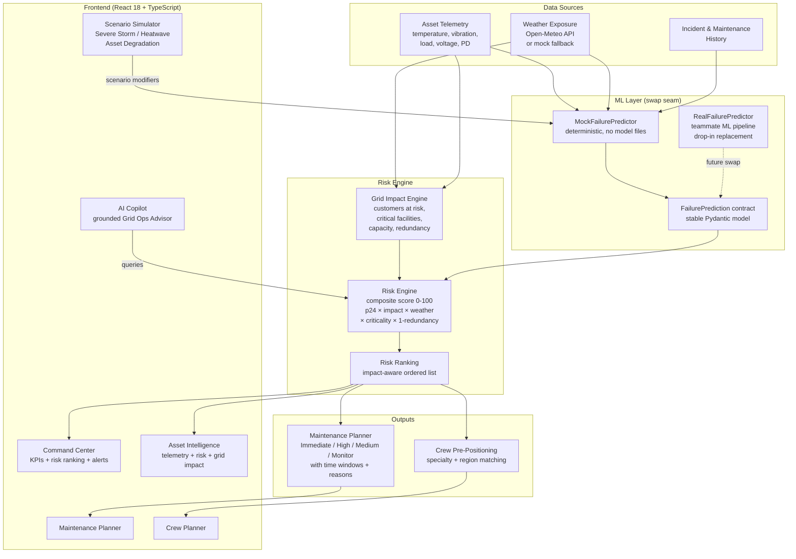

# Architecture — Bottleneck AI

## IBM Bob Hackathon 2026 — Track U1

---

## System Architecture Diagram



---

## Backend Module Map

```
backend/
├── main.py                  FastAPI app entry point (Bottleneck router mounted)
├── bottleneck/
│   ├── contracts.py         All Pydantic data contracts (stable integration seam)
│   ├── mock_data.py         30-asset deterministic synthetic fleet
│   ├── ml_adapter.py        MockFailurePredictor + FailurePredictor ABC
│   ├── grid_impact.py       Grid Impact Engine
│   ├── weather_adapter.py   Weather Exposure adapter (Open-Meteo + mock)
│   ├── risk_engine.py       Composite risk score + maintenance + crew assignment
│   ├── service.py           Orchestrator — composes all engines per request
│   ├── copilot.py           Grid Operations AI Advisor (Gemini + fallback)
│   └── routes.py            All 16 /api/gs/* FastAPI endpoints
├── weather/
│   └── provider.py          Open-Meteo HTTP client (reused from Bottleneck)
└── (legacy Bottleneck modules preserved)
```

---

## Frontend Module Map

```
frontend/src/
├── App.tsx                  Shell with sidebar navigation (Bottleneck + legacy)
├── api/
│   └── bottleneck.ts        TypeScript API client for all /api/gs/* endpoints
└── components/bottleneck/
    ├── CommandCenter.tsx     Dashboard: KPIs, alert bar, risk ranking table
    ├── AssetIntelligence.tsx Asset detail: telemetry charts, risk breakdown, incidents
    ├── MaintenancePlanner.tsx Filterable priority list with time windows
    ├── CrewPlanner.tsx       Crew assignment table with specialty/region
    ├── ScenarioSimulator.tsx Before/after risk comparison
    └── Copilot.tsx           Chat interface with grounded AI responses
```

---

## API Endpoints

All Bottleneck endpoints are prefixed `/api/gs/`:

| Method | Path | Description |
|--------|------|-------------|
| GET | `/api/gs/assets` | List all 30 grid assets (filterable by type/substation) |
| GET | `/api/gs/assets/{id}` | Single asset detail |
| GET | `/api/gs/assets/{id}/telemetry` | 48-hour hourly telemetry history |
| GET | `/api/gs/assets/{id}/incidents` | Incident history |
| GET | `/api/gs/assets/{id}/maintenance` | Maintenance history |
| GET | `/api/gs/assets/{id}/intelligence` | Full intelligence page bundle |
| GET | `/api/gs/weather` | Weather exposure (all assets or single) |
| GET | `/api/gs/predictions` | ML failure predictions |
| GET | `/api/gs/risk/ranking` | Impact-aware risk ranking |
| GET | `/api/gs/dashboard/kpis` | KPI counts for Command Center |
| GET | `/api/gs/dashboard/alerts` | Active alerts |
| GET | `/api/gs/maintenance/priorities` | Maintenance plan (filterable) |
| GET | `/api/gs/crew` | All field crews |
| GET | `/api/gs/crew/plan` | Crew pre-positioning plan |
| POST | `/api/gs/scenarios/simulate` | Run scenario (storm/heatwave/degradation) |
| POST | `/api/gs/chat` | AI copilot query |

---

## Risk Score Formula

```
base = p24^0.35 × impact^0.25 × weather^0.15 × criticality^0.15 × (1 − redundancy)^0.10

age_boost = min(age_years / 40, 1.0) × 0.05

raw = base + age_boost

risk_score = min(round(raw × 105), 100)    # normalized 0–100
```

Where:
- `p24` = 24-hour failure probability from ML predictor
- `impact` = grid impact score (customers, critical facilities, capacity)
- `weather` = weather exposure score (storm severity, temperature, wind)
- `criticality` = asset criticality metadata (0–1)
- `redundancy` = redundancy level (0–1; low redundancy → higher risk)
- `age_years` = asset age (older → small boost)

---

## ML Integration Seam

The ML boundary is deliberately isolated in one file and one class:

```python
# backend/bottleneck/ml_adapter.py

class FailurePredictor(ABC):
    """Stable interface — never changes."""
    @abstractmethod
    def predict(
        self,
        asset_id: str,
        latest_telemetry: dict,
        incidents: list,
        weather: dict,
        asset_age_years: float,
        asset_criticality: float,
    ) -> FailurePrediction:
        ...

class MockFailurePredictor(FailurePredictor):
    """Currently active. Deterministic, pre-computed per asset."""
    ...

class RealFailurePredictor(FailurePredictor):
    """TODO: teammate ML pipeline drops in here."""
    def predict(self, ...) -> FailurePrediction:
        # Call teammate's XGBoost/LSTM model
        ...

def get_predictor() -> FailurePredictor:
    if os.getenv("BOTTLENECK_USE_REAL_ML") == "1":
        return RealFailurePredictor()
    return MockFailurePredictor()
```

To integrate the real ML pipeline:
1. Implement `RealFailurePredictor.predict()` in `ml_adapter.py`
2. Set `BOTTLENECK_USE_REAL_ML=1` in `.env`
3. No other changes needed in the entire codebase

---

## Key Design Decisions

1. **Risk ≠ Probability** — composite score weighs grid impact equally with failure probability
2. **Determinism** — all mock data and predictions are seeded/fixed; demo is reproducible
3. **Graceful fallback** — weather API failure → mock weather; no LLM key → rule-based copilot
4. **No frontend coupling to ML** — frontend only knows `FailurePrediction` contract fields
5. **Legacy Bottleneck preserved** — all original routes and pages remain accessible
